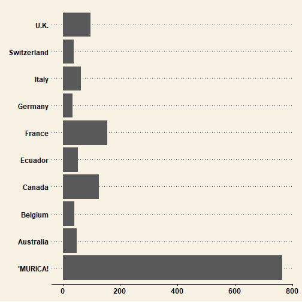
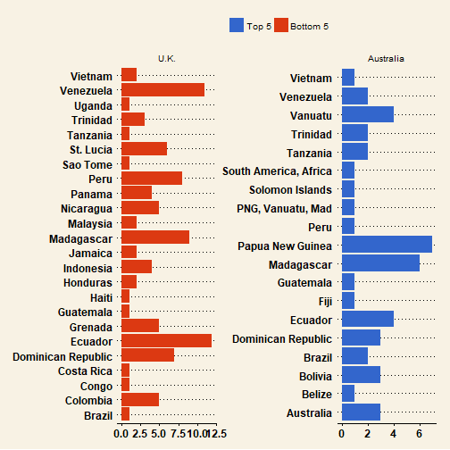

### Exploratory Cocoa Analysis  
NL

---

### The data

Flavors of Cacao  
available at [http://flavorsofcacao.com/index.html](http://flavorsofcacao.com/index.html)  

Expert ratings of over 1,700 individual chocolate bars, along with information on
- regional origin
- percentage of cocoa
- variety of chocolate bean used
- where the beans were grown

---

#### Where are most of the rated bars produced?

---

#### Where are the highest and lowest rated bars produced?

Vietnam: [The Best Chocolate You've Never Tasted](https://www.nytimes.com/2016/03/06/t-magazine/food/marou-vietnamese-chocolate.html)

---

#### ...and where do they source their beans?

<small>Perhaps there are more low quality beans from Ecuador, Peru, and Venezuela</small>  
<small>You want Brazilian and Vietnamese beans.</small>

---

#### Where do Australia (top 5) & U.K. (bottom 5) source their beans?
<small>they don't grow their own</small>  

<small>We see Ecuadorean and Venezuelan beans in low rated U.K. bars</small>

---

#### Is percentage of cocoa correlated with rating?

Doesn't look like anything to me.

---

#### Distribution of ratings by bean types, Top 10

[Criollo Porcelana: The holy grail of cocoa beans](https://www.somachocolate.com/blogs/news/18222553-porcelana-finally-after-a-decade-of-waiting)

---

#### Next time you go to whole foods...
Yay &#9786;  

 
Nay &#9785;  

---

### Happy eating!

---

[the code](cacao.R)
